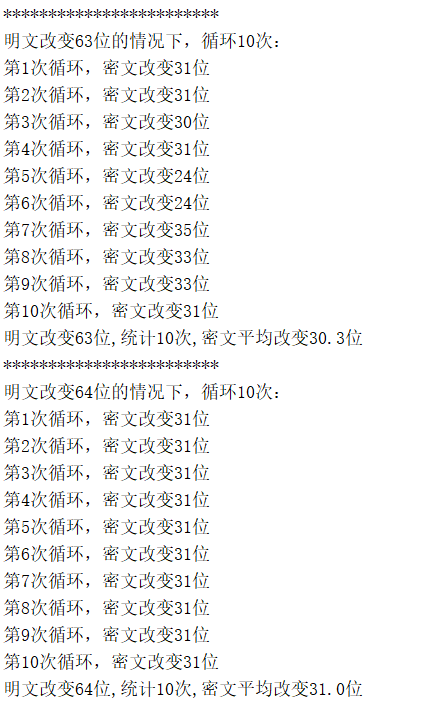

## 3218004808 DES作业

[TOC]

### 0.项目使用说明：

该md文件对代码文件使用作出说明，对具体实现步骤和原理的说明请见代码中注释。

#### （0）开发环境说明：

* 系统版本：Windows 10
* python版本：python 3.7
  * numpy库
  * math库
* 软件版本：pycharm 2019.1

#### （1）项目目录说明：

DES.py-------------------------------------------------DES源码

operation.py-------------------------------------------DES源码

**task23.py-----------------------------------------------作业**

*.png--------------------------------------------------md所需的图片

**使用说明：```python task23.py```**

### 2.题目解读以及代码实现

#### （1）题目解读->两种模式：

- **密钥固定，明文改变模式**

  ​		统计DES算法在密钥固定情况，输入明文改变1位、2位..64位时。输出密文位数改变情况。

- **明文固定，密钥改变模式**

  ​		统计DES算法在明文固定情况，输入密钥改变1位、2位..64位时。输出密文位数改变情况。

#### （2）代码实现

① 控制台输入8位的明文、8位的密钥、希望统计的循环次数

```
选择模式(2代表密钥固定，明文改变模式；3代表明文固定，密钥改变模式):2
请输入明文（8位字母或数字）：Security
请输入密钥（8位字母或数字）：AbcdefgH
请输入循环次数（1-100）：10
```


② 8位的明文、密钥、密文转化为64位的二进制数组

```python
initBitPlainText=operation.string2bin(plainText)
initBitKey=operation.string2bin(key)
cipher_bin=operation.string2bin(initCipherText)
```

③ 循环改变1-64位明文\密钥，得到新密文的二进制数组，接着与原密文的二进制数组比较改变了几位

```python
s1=changeText(initBitPlainText,n)
str1=DES.cipher(operation.bin2string(s1),operation.bin2string(initBitKey))
str1_bin=operation.string2bin(str1)
dif=checkBitDif(cipher_bin,str1_bin)
```

④ 循环统计次数lun，求出平均数

​	控制台输出：


**.........................(省略部分输出)**


